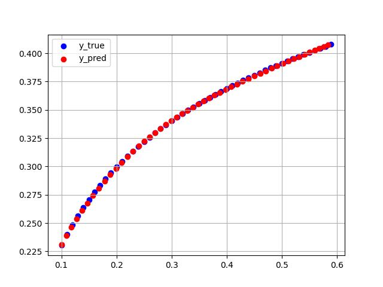
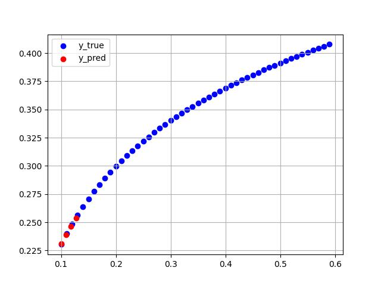
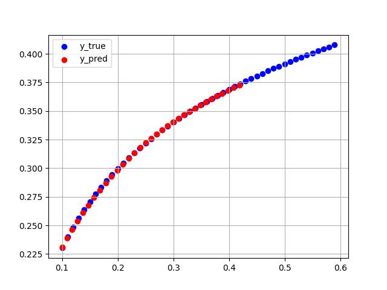
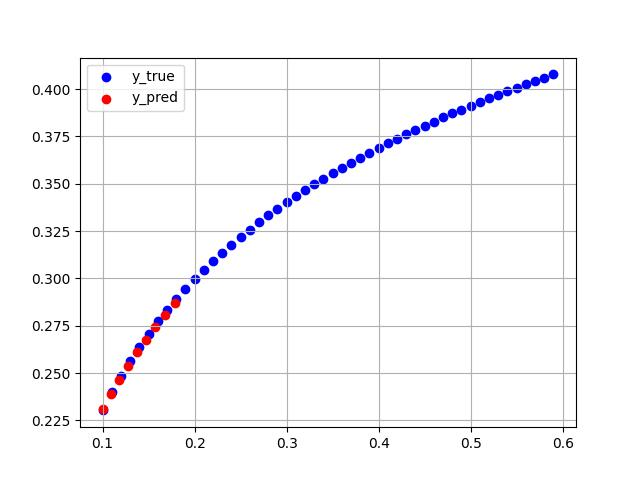
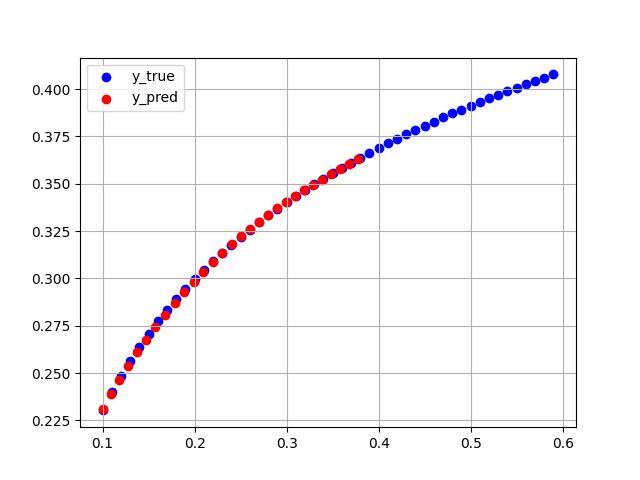
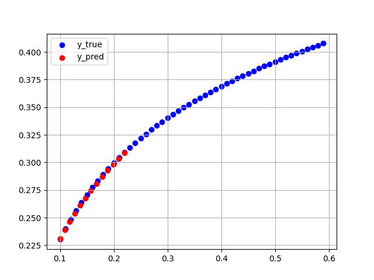

# LSTM 网络 PyTorch 转 TensorRT

## 1. 简介

1. 实现一个简单的 LSTM 示例：根据某曲线上 9 个连续的坐标，预测下一个坐标的值；
2. 训练得到的 `pth` 模型，先转为 `onnx` 格式，再转为 `tensorrt` 格式

## 2. 环境

### 2.1 宿主机基础环境

- Ubuntu 16.04
- GPU：GeForce RTX 2080 Ti
- CUDA 11.2
- docker，nvidia-docker

### 2.2 基础镜像拉取

```
docker pull nvcr.io/nvidia/tensorrt:22.04-py3
```

- 该镜像中各种环境版本如下：

| CUDA   | cuDNN    | TensorRT | python |
| ------ | -------- | -------- | ------ |
| 11.6.2 | 8.4.0.27 | 8.2.4.2  | 3.8.10 |

### 2.3 安装其他库

#### 2.3.1 创建 docker 容器

```bash
docker run -it --gpus device=0 --shm-size 32G -v /home/lstm:/workspace nvcr.io/nvidia/tensorrt:22.04-py3 bash
```

其中 `/home/lstm` 为本项目的路径

`-v /home/lstm:/workspace` 将宿主机的 `/home/lstm `目录挂载到容器中，方便一些文件的交互，也可以选择其他目录

#### 2.3.2 安装PyTorch

- 下载`torch-1.12.0`

```
进入链接 https://download.pytorch.org/whl/torch/
找到 torch-1.12.0+cu116-cp38-cp38-linux_x86_64.whl
下载后放到 /workspace 目录下
pip install torch-1.12.0+cu116-cp38-cp38-linux_x86_64.whl
```

- 下载`torchvision-0.13.0`

```
进入链接 https://download.pytorch.org/whl/torchvision/
找到 torchvision-0.13.0+cu116-cp38-cp38-linux_x86_64.whl
下载后放到 /workspace 目录下
pip install torchvision-0.13.0+cu116-cp38-cp38-linux_x86_64.whl
```

#### 2.3.3 安装其他 python 库

```bash
pip install cuda-python
pip install onnxruntime-gpu==1.10
pip install scipy
pip install matplotlib
pip install pandas
```

## 3. PyTorch训练和推理

### 3.1 训练

- 开启训练

```bash
python train.py
```

- 训练日志

```bash
root@abd2dd8ed72b:/workspace# python train.py
data shape:  (59, 2)
样本数：59，维度：2
X_train.shape:  torch.Size([50, 9, 2]) Y_train.shape:  torch.Size([50, 1, 2])
epoch=10 | loss=0.011636868549976498
epoch=20 | loss=0.00446924707503058
epoch=30 | loss=0.0007693093531997875
epoch=40 | loss=0.00019088271728833205
epoch=50 | loss=5.0381743312755135e-05
epoch=60 | loss=5.858952599737677e-05
```

### 3.2 推理

- 使用 `PyTorch` 模型预测

```bash
python torch_infer.py
```

- 预测日志

```bash
root@abd2dd8ed72b:/workspace# python torch_infer.py
data shape:  (59, 2)
样本数：59，维度：2
X_train.shape：  torch.Size([50, 9, 2]) Y_train.shape： torch.Size([50, 1, 2])
y_true.shape: (50, 2)
y_pred.shape: (50, 2)
Inference cost is: 0.1318 s
```

- 预测效果图

预测结束会在当前目录生成 `res.jpg`



## 4. TensorRT 转换

### 4.1 ONNX 转换及推理

转换、推理都通过运行 `onnx_infer.py` 实现

```bash
python onnx_infer.py
```

得到 `model.onnx` 模型文件，和 `res.jpg` 效果图

### 4.2 TensorRT 转换及推理

- 转换、推理都通过运行 `trt_infer.py` 实现

```bash
python trt_infer.py
```

得到 `model.plan` 模型文件，和 `res_1.jpg` ~ `res_5.jpg`效果图（模拟了 5 次随机 batch 的推理）

- 第一次运行包含转换和推理，后面再运行为加载模型并推理，日志如下：

```bash
root@abd2dd8ed72b:/workspace# python trt_infer.py
Succeeded finding ONNX file!
Succeeded parsing .onnx file!
Succeeded building engine!
[ 0]Input -> DataType.FLOAT (-1, 9, 2) (50, 9, 2) data
[ 1]Output-> DataType.FLOAT (-1, 1, 2) (50, 1, 2) output
data shape:  (59, 2)
样本数：59，维度：2
X_train.shape：  (50, 9, 2) Y_train.shape： (50, 1, 2)
========= infer count: 1 ========
y_pred.shape: (4, 2)
y_true.shape: (50, 2)
Inference cost is: 0.0008 s
========= infer count: 2 ========
y_pred.shape: (33, 2)
y_true.shape: (50, 2)
Inference cost is: 0.0008 s
========= infer count: 3 ========
y_pred.shape: (9, 2)
y_true.shape: (50, 2)
Inference cost is: 0.0008 s
========= infer count: 4 ========
y_pred.shape: (29, 2)
y_true.shape: (50, 2)
Inference cost is: 0.0008 s
========= infer count: 5 ========
y_pred.shape: (13, 2)
y_true.shape: (50, 2)
Inference cost is: 0.0008 s
```

- 推理效果图

|  |  |  |
| -------------------------- | -------------------------- | -------------------------- |
|  |  |                            |

